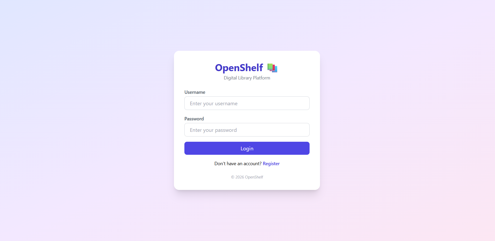
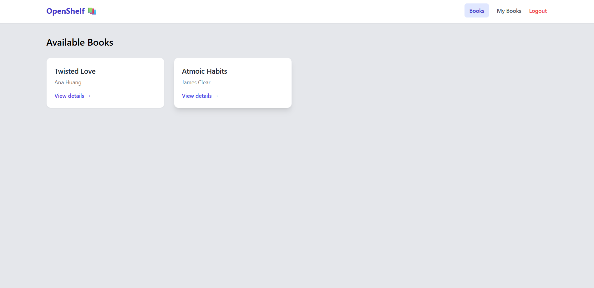
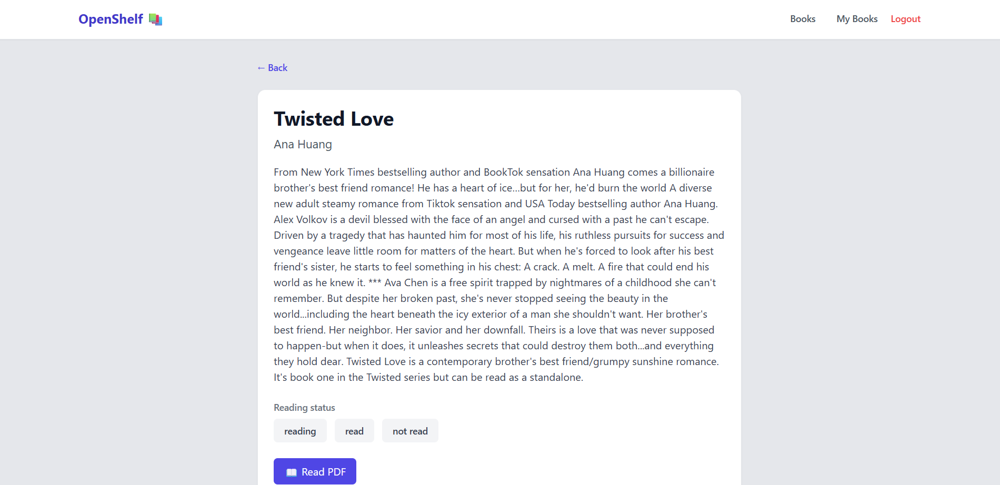
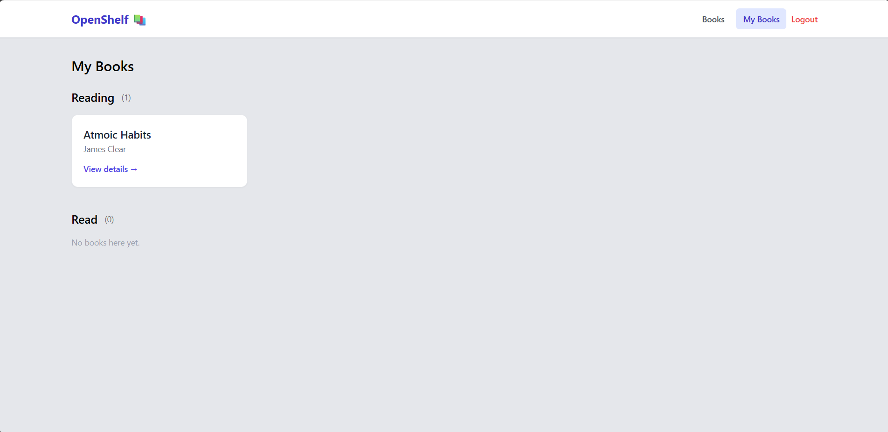

# OpenShelf 📚

**OpenShelf** is a full-stack digital library platform that lets users discover books, track their reading status, and access PDFs — with secure authentication and admin-managed content.

---

## ✨ Features

* 🔐 **Authentication**: Login & registration with JWT (auto-login after signup)
* 📖 **Books Catalog**: Browse available books with details
* 🟡 **Reading Status**: Mark books as *Reading*, *Read*, or *Not Read*
* 📂 **PDF Access**: Read book PDFs (when available)
* 🧑‍💼 **Admin Control**: Admins manage books securely via Django Admin
* 🔄 **Token Refresh Handling**: Safe auto-refresh with clean logout on expiry

---

## 🛠 Tech Stack

**Frontend**

* React
* React Router
* Axios
* Tailwind CSS

**Backend**

* Django
* Django REST Framework
* SimpleJWT (JWT Authentication)

**Database**

* SQLite (development)

---

## 🧑‍💼 Admin Workflow

* Book uploads and management are handled via **Django Admin**
* Only admin users can create/update books (API protected with `IsAdminUser`)
* PDFs are uploaded directly from the admin panel

> This mirrors real-world systems where content is managed separately from user-facing UIs.

---

## 🚀 Getting Started

### Backend Setup

```bash
cd backend
python -m venv venv
source venv/bin/activate  # Windows: venv\Scripts\activate
pip install -r requirements.txt
python manage.py migrate
python manage.py createsuperuser
python manage.py runserver
```

### Frontend Setup

```bash
cd frontend
npm install
npm run dev
```

App runs at:

* Frontend: `http://localhost:5173`
* Backend: `http://127.0.0.1:8000`

---

## 📸 Screenshots

* Login Page


* Books List


* Book Detail Page


* My Books Page


---

## 🔮 Future Enhancements

* 🔍 Search & filter books
* 🤖 AI-powered chatbot for book queries
* 🌐 Deployment (Vercel + Render)
* 👤 User profile & preferences

---

## 👤 Author

Built by **Shruddha S N**

---

## 📄 License

This project is for educational and portfolio purposes.
